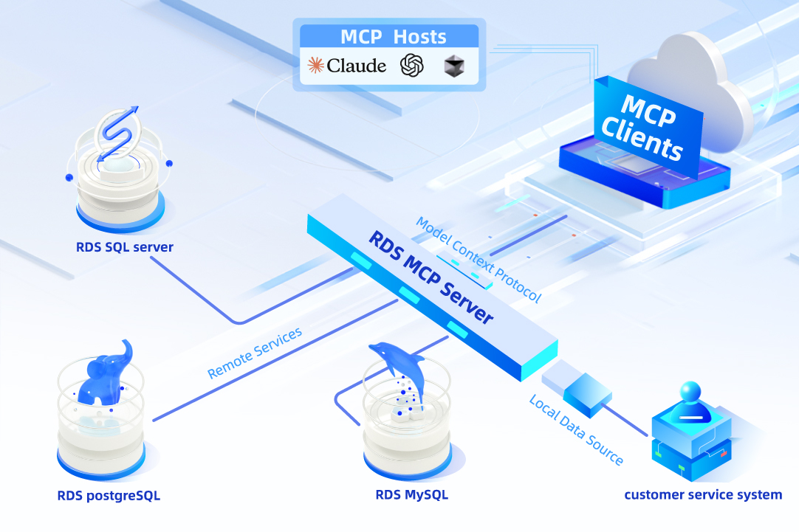

# 阿里云RDS OpenAPI MCP服务器

🚀 通过OpenAPI为阿里云RDS提供MCP服务器支持。本项目通过[MCP](https://github.com/CherryHQ/mcp)框架公开阿里云RDS、VPC和计费API，将常见的数据库管理任务打包成易于使用的工具。



> ⚠️ **注意**: 本说明文档基于Windows平台。

## 📋 目录
- [✨ 功能特性](#-功能特性)
- [📋 先决条件](#-先决条件)
- [🔧 安装](#-安装)
- [⚙️ 配置](#️-配置)
- [🚀 快速开始](#-快速开始)
- [🛠️ 可用工具](#️-可用工具)
- [💡 使用场景](#-使用场景)
- [🔌 集成方式](#-集成方式)
- [🤝 贡献指南](#-贡献指南)
- [📄 许可证](#-许可证)
- [💬 技术支持](#-技术支持)

## ✨ 功能特性

- 🏗️ **全面的RDS管理**: 创建、配置和管理RDS实例
- 🔒 **安全与合规**: IP白名单管理和安全审计
- 📊 **性能监控**: 查询性能指标和日志
- 💰 **成本优化**: 计费分析和资源优化
- 🌐 **多环境支持**: 开发、测试和生产环境
- 🔗 **VPC集成**: 完整的VPC和交换机管理功能

## 📋 先决条件

- 🐍 Python 3.12 或更高版本
- ☁️ 拥有适当权限的阿里云账户
- 🔑 Access Key ID 和 Access Key Secret（或STS Token）

## 🔧 安装

### 方式一：使用uv快速启动（推荐）

1. **安装uv**
   ```powershell
   powershell -ExecutionPolicy ByPass -c "irm https://astral.sh/uv/install.ps1 | iex"
   ```

2. **运行服务器**
   ```bash
   uvx alibabacloud-rds-openapi-mcp-server@latest
   ```

### 方式二：从源码安装

1. **安装Python 3.12+**
   
   从[Python官网](https://www.python.org/downloads/)下载

2. **克隆仓库**
   ```bash
   git clone https://github.com/aliyun/alibabacloud-rds-openapi-mcp-server.git
   cd alibabacloud-rds-openapi-mcp-server
   ```

3. **安装依赖**
   ```bash
   pip install -i https://mirrors.aliyun.com/pypi/simple/ alibabacloud_bssopenapi20171214
   pip install -i https://mirrors.aliyun.com/pypi/simple/ alibabacloud_rds20140815
   pip install -i https://mirrors.aliyun.com/pypi/simple/ alibabacloud_vpc20160428
   pip install -i https://mirrors.aliyun.com/pypi/simple/ mcp
   ```

4. **运行服务器**
   ```bash
   python src/alibabacloud_rds_openapi_mcp_server/server.py
   ```

## ⚙️ 配置

### 环境变量设置

在启动MCP服务器之前，需要设置必要的环境变量：

#### PowerShell配置
```powershell
# 设置服务器传输模式
$env:SERVER_TRANSPORT="sse"

# 设置阿里云凭证
$env:ALIBABA_CLOUD_ACCESS_KEY_ID="<您的AccessKey ID>"
$env:ALIBABA_CLOUD_ACCESS_KEY_SECRET="<您的AccessKey Secret>"

# 可选：使用临时凭证时设置STS Token
$env:ALIBABA_CLOUD_SECURITY_TOKEN="<您的STS安全令牌>"
```

#### 命令提示符(CMD)配置
```cmd
REM 设置服务器传输模式
set SERVER_TRANSPORT=sse

REM 设置阿里云凭证
set ALIBABA_CLOUD_ACCESS_KEY_ID=<您的AccessKey ID>
set ALIBABA_CLOUD_ACCESS_KEY_SECRET=<您的AccessKey Secret>

REM 可选：使用临时凭证时设置STS Token
set ALIBABA_CLOUD_SECURITY_TOKEN=<您的STS安全令牌>
```

> ⚠️ **重要提示**: 请将`<占位符>`替换为您的真实凭证信息。这些环境变量仅在当前终端会话中有效。

## 🚀 快速开始

### 服务器启动验证

成功启动后，您将看到类似以下的输出：
```
INFO: Started server process [进程ID]
INFO: Waiting for application startup.
INFO: Application startup complete.
INFO: Uvicorn running on http://0.0.0.0:8000 (Press CTRL+C to quit)
```

### 测试安装

配置完成后，可以使用简单的提示词测试MCP工具的有效性：
```
请列出所有可用工具，列表方式，显示标题以及对应的简短描述。
```

## 🛠️ 可用工具

### 🏗️ RDS实例管理
- `create_db_instance`: 创建RDS实例
- `describe_db_instances`: 查询实例
- `describe_db_instance_attribute`: 查询实例详细信息
- `modify_db_instance_description`: 修改RDS实例描述
- `modify_db_instance_spec`: 修改RDS实例规格
- `restart_db_instance`: 重启RDS实例

### 🔒 安全与访问控制
- `modify_security_ips`: 修改IP白名单
- `describe_db_instance_ip_allowlist`: 批量查询IP白名单配置
- `attach_whitelist_template_to_instance`: 将白名单模板绑定到实例
- `describe_all_whitelist_template`: 查询白名单模板列表
- `describe_instance_linked_whitelist_template`: 查询绑定到实例的白名单模板列表

### 👥 数据库与用户管理
- `create_db_instance_account`: 创建RDS实例账号
- `describe_db_instance_accounts`: 批量查询账户信息
- `describe_db_instance_databases`: 批量查询数据库信息

### 🌐 网络与连接
- `allocate_instance_public_connection`: 为RDS实例分配公网连接
- `describe_db_instance_net_info`: 批量查询网络配置详情
- `describe_vpcs`: 查询VPC列表
- `describe_vswitches`: 查询VSwitch列表

### 📊 监控与性能
- `describe_db_instance_performance`: 查询实例性能数据
- `describe_error_logs`: 查询实例错误日志
- `describe_slow_log_records`: 查询RDS实例的慢日志记录
- `describe_db_instance_parameters`: 批量查询参数信息
- `modify_parameter`: 修改RDS实例参数

### 📦 资源管理
- `describe_available_classes`: 查询可用实例规格和存储范围
- `describe_available_zones`: 查询RDS实例可用区域
- `add_tags_to_db_instance`: 添加标签到RDS实例

### 💰 计费与成本管理
- `describe_bills`: 查询用户在特定计费周期内所有产品实例或计费项的消费汇总

### 🔧 实用工具
- `get_current_time`: 获取当前时间

## 💡 使用场景示例

### 场景一：资源调配与环境初始化 🏗️

**在杭州区域创建生产RDS MySQL实例:**
```
在cn-hangzhou可用区生产一个RDS MySQL实例，配置、版本、白名单等信息与实例rm-bp1696hd82oc438fl保持完全一致，并打上标签：生产环境审计、月底前释放
```

**创建只读用户账号:**
```
在cn-hangzhou区域的实例 rm-bp1696hd82oc438fl 上，创建一个只读账号readonly_user，密码为:Strong!Pa$$word  并授予它访问 report_db 数据库的只读权限。
```

### 场景二：安全与合规性自动化审计 🔒

**添加堡垒机IP到安全组:**
```
立即将堡垒机新IP 100.101.102.103 添加到所有cn-hangzhou可用区的RDS MySQL实例的'ops_allowlist'安全组中。
```

**安全合规审计:**
```
审计所有的RDS SQL Server实例，找到cn-hangzhou中所有白名单中不包含 123.123.123.123 IP的实例
```

### 场景三：成本优化 💰

**基于性能的成本优化:**
```
分析cn-hangzhou区域过去3天月所有标签为"测试环境"的RDS MySQL实例，找出 CPU 平均使用率低于 5% 的，并建议一个更经济的实例规格。
```

### 场景四：常见运维操作 🔧

**实例故障排除:**
```
cn-hangzhou实例rm-bp1696hd82oc438f目前无法连接，请立即尝试重启该实例。
```

## 🔌 集成方式

### Cherry Studio集成（推荐）🍒

Cherry Studio是一个功能强大的MCP客户端，提供直观的图形界面来管理和使用MCP服务器。

在MCP客户端配置文件中添加以下配置：

```json
{
  "mcpServers": {
    "rds-openapi-mcp-server": {
      "command": "uvx",
      "args": [
        "alibabacloud-rds-openapi-mcp-server@latest"
      ],
      "env": {
        "ALIBABA_CLOUD_ACCESS_KEY_ID": "your_access_id",
        "ALIBABA_CLOUD_ACCESS_KEY_SECRET": "your_access_key",
        "ALIBABA_CLOUD_SECURITY_TOKEN": "your_sts_token"
      }
    }
  }
}
```

<div align="left">
  
</div>
*在Cherry Studio中配置RDS MCP服务器*

<div align="left">
  
</div>
*在Cherry Studio中提问展示所有可用的工具*


> 📝 **注意**: `ALIBABA_CLOUD_SECURITY_TOKEN` 仅在使用STS Token时填入，如果使用AccessKey方式请保留该值为空。


### Claude Desktop集成 🤖

在MCP客户端配置中添加：

```json
{
  "mcpServers": {
    "rds-openapi-mcp-server": {
      "command": "uv",
      "args": [
        "--directory",
        "d:/path/to/alibabacloud-rds-openapi-mcp-server/src/alibabacloud_rds_openapi_mcp_server",
        "run",
        "server.py"
      ],
      "env": {
        "ALIBABA_CLOUD_ACCESS_KEY_ID": "your_access_id",
        "ALIBABA_CLOUD_ACCESS_KEY_SECRET": "your_access_key",
        "ALIBABA_CLOUD_SECURITY_TOKEN": "your_sts_token"
      }
    }
  }
}
```

## 🤝 贡献指南

我们欢迎您的贡献！请按照以下步骤操作：

1. 🍴 Fork本仓库
2. 🌟 创建特性分支 (`git checkout -b feature/amazing-feature`)
3. 💾 提交您的修改 (`git commit -m '添加新特性'`)
4. 📤 推送到分支 (`git push origin feature/amazing-feature`)
5. 🔄 创建Pull Request

### 开发指南

- 💻 确保代码符合Python PEP 8规范
- ✅ 添加适当的测试用例
- 📚 更新相关文档
- 🔍 运行所有测试确保通过

## 📄 许可证

本项目采用Apache 2.0许可证 - 查看[LICENSE](LICENSE)文件了解详情。

## 💬 技术支持

如有问题、意见或需要支持，请通过以下方式联系我们：

- 💬 **钉钉群**: 106730017609
- 🐛 **GitHub Issues**: [创建问题](https://github.com/aliyun/alibabacloud-rds-openapi-mcp-server/issues)
- 📧 **邮件支持**: [联系我们](mailto:support@example.com)

### 常见问题 ❓

<details>
<summary>如何获取阿里云AccessKey？</summary>

1. 登录阿里云控制台
2. 点击右上角头像，选择"AccessKey管理"
3. 创建新的AccessKey对
4. 妥善保管AccessKey Secret

</details>

<details>
<summary>支持哪些RDS数据库引擎？</summary>

目前支持：
- MySQL
- SQL Server  
- PostgreSQL
- MariaDB

</details>

